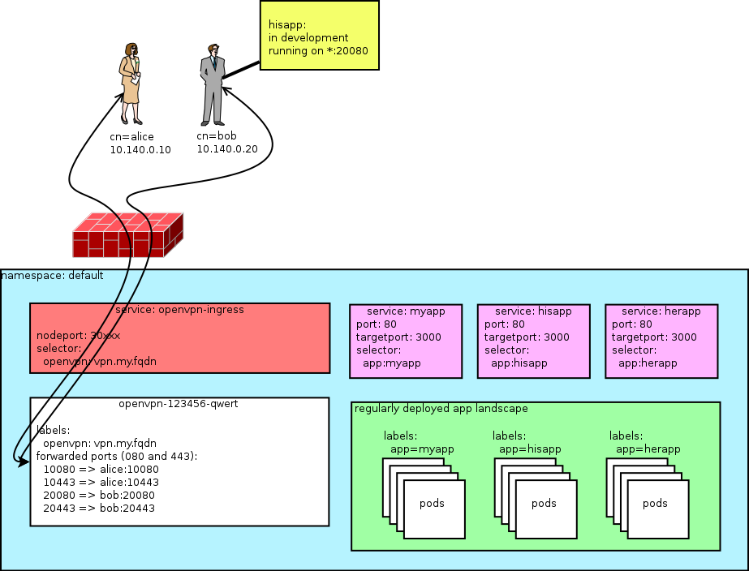
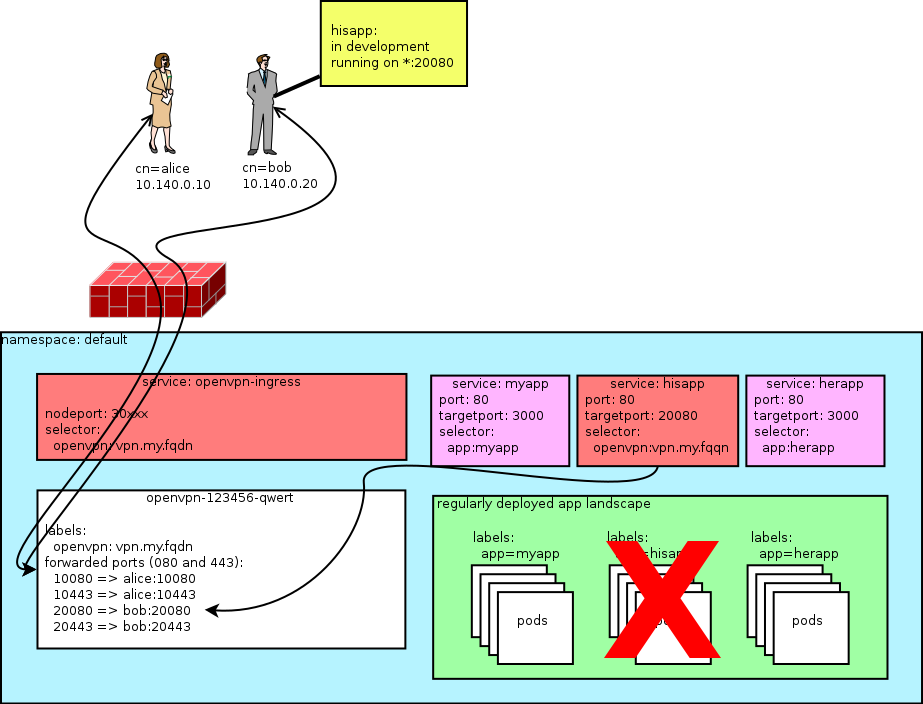

kube-openvpn
==================

[](https://quay.io/repository/plange/openvpn)
[](https://hub.docker.com/r/ptlange/openvpn/)

## Synopsis
Simple OpenVPN deployment using native kubernetes semantics. There is no persistent storage, CA management (key storage, cert signing) needs to be done outside of the cluster for now. I think this is better - unless you leave your keys on your dev laptop.

## Motivation
The main motivator for this project was having the ability to route service requests back to local apps (running on the VPN client), making life much easier for development environments where developers cannot run the entire app stack locally but need to iterate on 1 app quickly.

## Usage
First, you need to initialize your PKI infrastructure. Easyrsa is bundled in this container, so this is fairly easy. Replace `OVPN_SERVER_URL` with your endpoint to-be.
```
$ docker run --user=$(id -u) -e OVPN_SERVER_URL=tcp://vpn.my.fqdn:1194 -v $PWD:/etc/openvpn:z -ti ptlange/openvpn ovpn_initpki
```
Follow the instructions on screen. Remember (or better: securely store) your secure password for the CA. You are now left with a `pki` folder in your current working directory.

Generate the initial Certificate Revocation List. This file needs to be updated every `$EASYRSA_CRL_DAYS`. All clients will be blocked when this file expires.
```
$ docker run --user=$(id -u) -e EASYRSA_CRL_DAYS=180 -v $PWD:/etc/openvpn:z -ti ptlange/openvpn easyrsa gen-crl
```


Getting service_cidr and pod_cidr within google cloud:

service_cidr:

```
gcloud container clusters describe <your clustername> | grep servicesIpv4Cidr
```

pod_cidr:

```
gcloud container clusters describe <your clustername> | grep clusterIpv4Cidr
```

Deploy the VPN server (namespace needs to exist already):

```
$ ./kube/deploy.sh
Usage: ./kube/deploy.sh <namespace> <OpenVPN URL> <service cidr> <pod cidr>

$ ./kube/deploy.sh default tcp://vpn.my.fqdn:1194 10.3.0.0/24 10.2.0.0/16
secret "openvpn-pki" created
configmap "openvpn-settings" created
configmap "openvpn-ccd" created
deployment "openvpn" created
You have exposed your service on an external port on all nodes in your
cluster.  If you want to expose this service to the external internet, you may
need to set up firewall rules for the service port(s) (tcp:30xxx) to serve traffic.

See http://releases.k8s.io/release-1.3/docs/user-guide/services-firewalls.md for more details.
service "openvpn-ingress" created
```

Your VPN endpoint is now reachable on every node in the cluster on port 30XXX. This port can be easily exposed by setting the `Type` field of the openvpn Service to `LoadBalancer` if you're running your cluster within a public cloud. Assign the correct `CNAME`/`A` address to your loadbalancer or replace the original servername with the DNS name of your newly created loadbalancer in your client configuration.

## Accessing the cluster
With the pki still in `$PWD/pki` we can create a new VPN user and grab the `.ovpn` configuration file:

```
# Generate VPN client credentials for CLIENTNAME without password protection; leave 'nopass' out to enter password
$ docker run --user=$(id -u) -v $PWD:/etc/openvpn:z -ti ptlange/openvpn easyrsa build-client-full CLIENTNAME nopass
$ docker run --user=$(id -u) -e OVPN_SERVER_URL=tcp://vpn.my.fqdn:1194 -v $PWD:/etc/openvpn:z --rm ptlange/openvpn ovpn_getclient CLIENTNAME > CLIENTNAME.ovpn
```

`CLIENTNAME.ovpn` can now be used to connect to the cluster and interact with k8s services and pods directly. Whoohoo!




## Routing back to the client via port forward

In order to route cluster traffic back to a service running on the client, we need to assign `CLIENTNAME` a static IP. If you have not configured an `$OVPN_NETWORK` you need to pick something in the `10.140.0.0/24` range.

Edit the CCD (client configuration directory) configmap:
```
$ kubectl edit configmap openvpn-ccd
```
Look at the example and add another entry for the `CLIENTNAME` you added before. You do not have to restart openvpn but if you are already connected you will need to reconnect to get the static IP.

Next you have to define what port on the openvpn pod to route back to the client. The port forwarding will automatically load after the configmap has been updated.
```
$ kubectl edit configmap openvpn-portmapping
```



You can now reach the openvpn client! If you want to substitute a kubernetes service for a service running on the client, simply modify the label selector to match your openvpn endpoint address and the `targetPort` just configured in the openvpn-portmapping configmap.

Exampe service definition routing service `myapp` on port 80 to the `example` client's service running on port 80.
```yaml
apiVersion: v1
kind: Service
metadata:
  name: myapp
spec:
  ports:
  - port: 80
    targetPort: 20080
  selector:
    openvpn: vpn.my.fqdn
```

## Routing back to the client via the routing table

It is possible to access the clients in the VPN network from pods running in the cluster, however this requires certain preparations and arises some new problems.

Since pods are capable of accessing each other, if a route is set in the one which wants to access the clients, then traffic will be routed through the VPN server pod into the client network.

Via a service account, it is possible to find out the IP of the VPN server pod, and it can be added as the gateway for the VPN network. This can be achieved by the following startup script:

```bash
#! /usr/bin/env bash

PORT="6443"
TOKEN=$(cat /var/run/secrets/kubernetes.io/serviceaccount/token)
NAMESPACE=$(cat /var/run/secrets/kubernetes.io/serviceaccount/namespace)

test -z OVPN_NETWORK && OVPN_NETWORK="10.140.0.0/24"

export VPN_IP=$(curl -s
  --cacert /var/run/secrets/kubernetes.io/serviceaccount/ca.crt \ 
  -H "Authorization: Bearer $TOKEN" \
  https://kubernetes.default.svc:$PORT/api/v1/namespaces/$NAMESPACE/pods \
  | jq -r '.items[] | select(.metadata.name | contains("openvpn")) | .status.podIP')

ip route add $OVPN_NETWORK via $VPN_IP

# TODO: invoke original entry point here
```

The script relies on the following assumptions:
+ The Kubernetes API is exposed through port 6443
+ `curl` & `jq` are installed in the container (and `ip` too, but it's probably pre-installed)
+ The VPN server is in the same namespace as the pod using this script
+ The name of the pod running the server contains the string `"openvpn"`
+ The pod is using a service account with a role capable of listing pods in the current namespace (like [this](https://kubernetes.io/docs/reference/access-authn-authz/rbac/#role-example))
+ If `OVPN_NETWORK` was specified when the server was configured, the same value is expected in the same environmental variable

This approach has one serious limitation: as pods die and respawn, their IP is changing, so the possible restarts of the VPN server must be handled in the pod accessing the clients. The route must be deleted, the new IP must be queried and the route must be recreated with the new IP every time a restart occurs. This can be monitored and implemented many ways. **NOTE: If this is not implemented, connection will be broken until the pod is restarted**

In order to access clients this way, setting static IPs for them is not necessary, but unless manual lookup is implemented, it might be useful.

Unfortunately, the service of the VPN server cannot be used, since it's designed to operate in the Transport Layer, while this solution provides Internet Layer access.

## Custom openvpn configuration
User-specific settings need to be set in the client config directory by editing the `openvpn-ccd` ConfigMap

You can also use your own openvpn configuration by mounting in a `openvpn.tmpl` file in `/etc/openvpn/templates/`. Create your own `openvpn.tmpl` from the example in this repository. Load it into a configmap with `kubectl create configmap openvpn-template --from-file=openvpn.tmpl`. Now edit the openvpn deployment configuration and add in an extra mountpoint at `/etc/openvpn/templates` for the `openvpn-template` configmap.

Note that you can use environment variables in the template!

## Updating the CRL
Use the `crl-update.sh` script. This extends the CRL for another 182 days by default. If you automate this i recommend setting this far shorter.

```
$ ./kube/update-crl default
```

## Tests
NONE. See next section.

## Contributing
Please file issues on github. PR's are welcomed.

## Thanks
I used kylemanna/openvpn extensively for a long time and lend quite a few of his scripts for easing the PKI handling. offlinehacker/openvpn-k8s provided some inspiration as well and showed i can run openvpn without any persistent storage, prompting me to write this collection of scripts.
